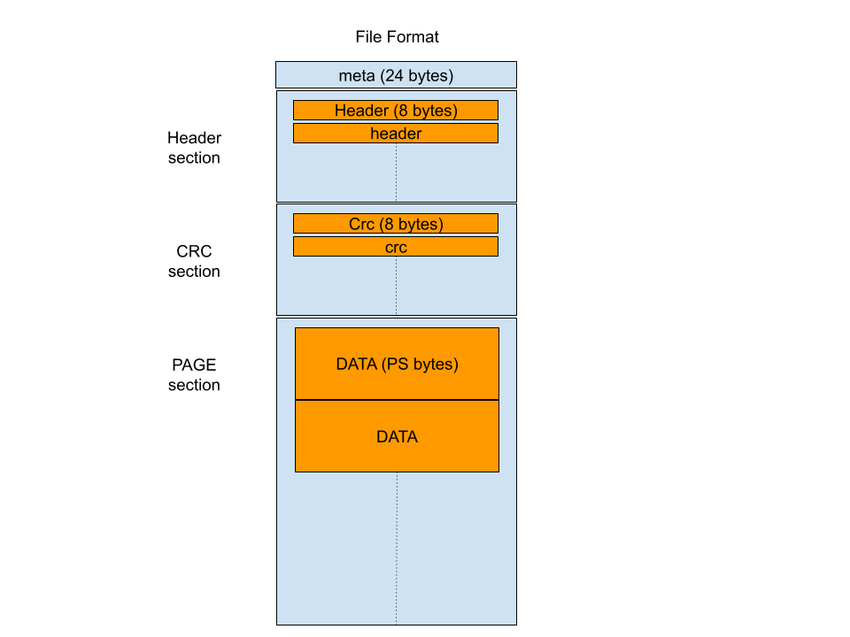

# Technical details

This document will describe the implementation details of qbd

## File Format

As you already know, qbd uses a single cache file and one or more persisted storage files

- The cache file does not add to the total size of the block device
- The size of the block device equal to the storage files total size

`QBD` actually does not care about the actual speed of the underlying hardware. So you still can place
the cache file on a slow storage, but this will make the entire device slow and you gain nothing from
using `qbd`

Both `cache` and `storage` file uses the following file format to store and retrieve blocks

The file consists always of the following sections:

- `meta` which is 24 bytes. The meta is laid out as follows (all numbers are in big-indian format)
  - 4 bytes magic. used to recognize the file format this always must equal to `0x617a6d79`
  - 4 bytes, version number, always set to `1`
  - 4 bytes, pages size. is set during creation of this file. This is used to make sure the page-size used during creation is always used.
  - 4 bytes, data-size, is the size of the data section.

The number of the pages possible in the file is basically `data-size/page-size` which means data-size must be multiple of page-size. By default we use a page size of `1mib`

The page size is very important because a page is the unit that is written to the  backend (persisted storage)

- `header` section, is where we keep information about each page. A header is exactly 8 bytes. the header at index 0 (in the header section) is associated with the page at index 0 (in the page section), and so on. The header is 8 bytes and used as follows:
  - 4 bytes, for flags (more on that later)
  - 4 bytes, an index number is stored which links this page in the file to a global index in the block device.
- `crc` section, is similar to header but contains CRC checksum of the page associated with it. it's currently not being used but reserved for future use.

- `page` section, where the actual page data is stored.

## Device and Cache

We split the device into virtual pages (or pages for short). For example if we have a 10mib device, with a page size of `1mib` then we have 10 pages. The pages then are indexed from 0 to 9.

When a part of the device is being accessed (read/or write) we figure out which page this operation falls into, the cache is then consulted to see if we already have this page in cache.

Cache operation is as follows:

- We maintain an in memory LRU cache of what blocks are being most used. The global page index is used as a key, which the value is the address (local index) of this page in the cache file
- Since the cache is by definition smaller than the full device size, the cache file can't possibly hold all possible pages.
- If for example global page `0` was **NOT** in the LRU cache, then the backend store is used to retrieve this page.
- The page is then written to the first empty slot in the cache file:
  - if the cache is not full, then the first empty page is used.
  - if the cache is full, we use the LRU cache to know which page is the least used to evict and free its place.
- Once a slot is known (say local cache page 10) the page is written to the proper place in the page section and the header is updated as follows:
  - header flags are set to (occupied=true, dirty=false)
  - the index part is set to the global index of this page (0 in this case)
- The LRU cache is updated

All the following operation against the same page will always hit the cache. Since it's now in the cache file, as follows:

- Page with global index 0 will be found in the lru cache, and point to local index 10.
- Read operation can then access the data part of the page
- A write operation can update the data part, BUT it also gonna set the header flag to **(dirty=true)**

On restarting the device, the LRU is lost but it's very easy to build from the cache file as follows:

- We go over all the headers in the header section
- For each header we know it's local address, and if occupied is true, then we know the page hast to be in the LRU cache
- we read the global index part of the header
- we build the LRU cache again as (global_index as a key, local_index as a value)

## Eviction

Eviction happens mainly when the cache is full (no free slots) and we need to move something from permanent storage to cache. Then if the page needed to be evicted is marked as dirty, the page is first written to permanent storage before the slot is being reused.

To avoid getting blocked when doing read/write operations we also run a background eviction that evict least used and dirty pages to backend, the eviction does not remove the page from the cache but just mark it as `not-dirty` any more. This means when the device need to evict it, it will skip the eviction part and just reuse the page for the page that need to be retrieved which will save on time when warming the cache for the new page.

The background eviction happens if the device was inactive (no read/write) for 500ms, it tries to evict as much pages as possible during a 50ms slice, then give time for the device again to serve read/writes before it tries again.

A device under heavy load will then not do any background eviction

## Store file

The permanent store file are the same files as the cache except that the way we use them makes pages are always stored at their global index.

This allows us to `concat` multiple backend files to act as one big backend store. say we have 2 store files each can hold 100mib of data

- segment 0 (100mib)
- segment 1 (100mib)

The the total size of the device is 200mib, but when we access global page index 0 it will lay at index 0 of segment 0, but when accessing page 100, that will be index 0 of segment 1 and so on.
