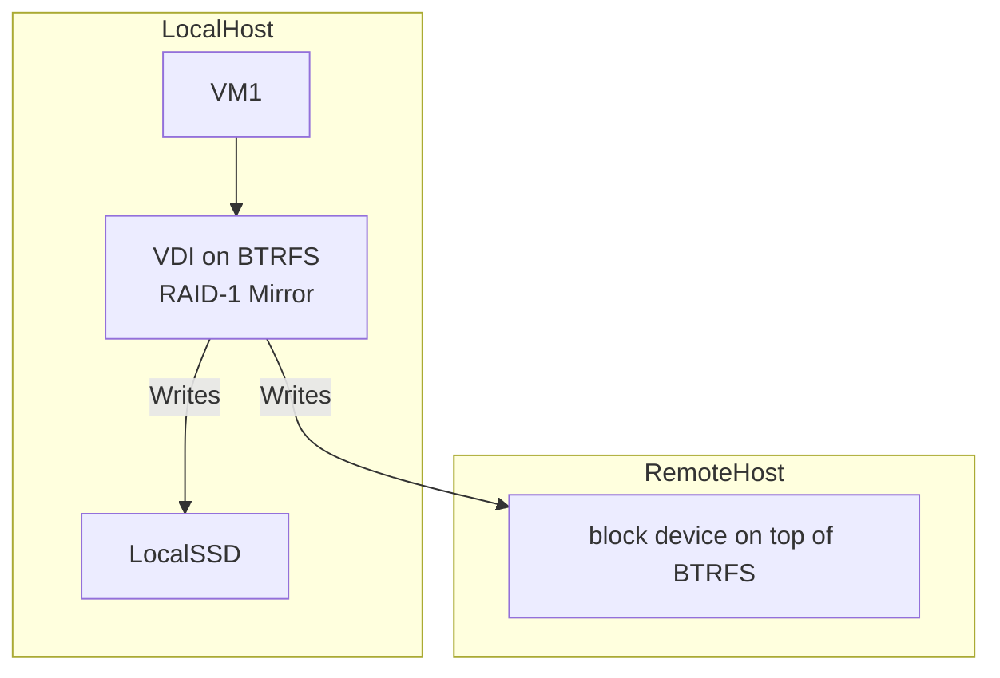

To create a redundant Virtual Disk Image (VDI) setup for KVM using **BTRFS** mirroring across a local BTRFS volume and a remote BTRFS volume over a network (using NBD or another remote storage protocol), we can take advantage of BTRFS's built-in mirroring and RAID features, combined with network block devices.

Here’s how you can implement this setup:

### Steps to Set Up a BTRFS Mirror for VDI (Local and Remote)

#### 1. **Create the BTRFS Filesystem Locally and Remotely**
You will create a **local BTRFS volume** and a **remote BTRFS volume** for redundancy.

##### On the Local Host:
Create a BTRFS filesystem on a local disk partition.

```bash
mkfs.btrfs /dev/sdb
mkdir /mnt/btrfs_local
mount /dev/sdb /mnt/btrfs_local
```

##### On the Remote Host (using NBD):
Set up a BTRFS volume on the remote host. You can use **NBD** (Network Block Device) to expose the remote storage as a block device.

1. Install the NBD server on the remote machine and create a BTRFS volume:

```bash
# Remote server
sudo apt install nbd-server
mkfs.btrfs /dev/sdc  # Assuming /dev/sdc is the remote disk
```

2. Configure the NBD server by editing `/etc/nbd-server/config` on the remote host:

```bash
[export]
    exportname = /dev/sdc
    readonly = false
    listenaddr = 0.0.0.0  # Make it accessible remotely
```

Start the NBD server:

```bash
sudo systemctl start nbd-server
```

3. On the local host, connect to the remote BTRFS volume using NBD:

```bash
# Local machine
sudo apt install nbd-client
sudo nbd-client <remote-ip> 10809 /dev/nbd0
```

Now, `/dev/nbd0` is your remote block device, and you can mount it or create a BTRFS volume on it.

4. Mount the remote BTRFS volume:

```bash
mkdir /mnt/btrfs_remote
mount /dev/nbd0 /mnt/btrfs_remote
```

#### 2. **Set Up BTRFS RAID-1 for Mirroring**
BTRFS supports RAID-1 mirroring across multiple devices, including a combination of local and remote devices (such as NBD). This means that all writes will be mirrored across both the local BTRFS device and the remote BTRFS device.

To set up a mirrored BTRFS filesystem across your local and remote volumes, do the following:

```bash
# Create a BTRFS RAID-1 filesystem using the local disk and the remote NBD device
btrfs device add -f /dev/sdb /dev/nbd0 /mnt/btrfs_local

# Convert the BTRFS filesystem to RAID-1 (mirrored)
btrfs balance start -dconvert=raid1 -mconvert=raid1 /mnt/btrfs_local
```

In this setup:
- `-dconvert=raid1`: Mirrors the data across the two devices.
- `-mconvert=raid1`: Mirrors the metadata across the two devices.

At this point, your BTRFS volume is mirrored between the local and remote devices. Any changes to the local VDI file will be mirrored to the remote BTRFS volume.

#### 3. **Create a VDI Image on the BTRFS Volume**
Now that you have a mirrored BTRFS volume, create a VDI image for your KVM virtual machine:

```bash
qemu-img create -f vdi /mnt/btrfs_local/vm1.vdi 20G
```

This VDI image will automatically be mirrored across the local and remote BTRFS volumes because of the RAID-1 setup.

#### 4. **Start the VM Using the VDI Image**
Start the virtual machine using the VDI image stored on the mirrored BTRFS volume:

```bash
qemu-system-x86_64 -drive file=/mnt/btrfs_local/vm1.vdi,format=vdi,if=virtio -m 2048
```

Any data written to the VDI image will be replicated across both the local and remote BTRFS volumes, providing redundancy and fault tolerance.

#### 5. **Monitor the BTRFS Mirror**
You can monitor the status of the BTRFS RAID setup using the following commands:

```bash
# Check the status of the BTRFS filesystem
btrfs filesystem df /mnt/btrfs_local

# Check the RAID status and verify that both devices are in use
btrfs device stats /mnt/btrfs_local
```

#### 6. **Handling Failover**
In case of failure (e.g., network disruption or remote server failure), the local BTRFS device will continue to function normally. You can later restore the remote device by reconnecting it using NBD and rebalancing the BTRFS volume.

To restore the mirror after the remote device becomes available again:

```bash
sudo nbd-client <remote-ip> 10809 /dev/nbd0  # Reconnect to remote NBD

# Rebalance the BTRFS RAID-1 mirror

btrfs balance start -dconvert=raid1 -mconvert=raid1 /mnt/btrfs_local
```

### Visual Representation

Here is a Mermaid diagram representing the BTRFS mirror setup across a local and remote volume:



### Explanation:
- The virtual machine (`VM1`) is running on the **LocalHost** and writes data to the **VDI** on the local BTRFS volume.
- The **LocalVDI** is mirrored using BTRFS RAID-1 mirroring over **NBD**.

### Tests

see the vdi.md specs

### questions

- how to do live migration? is it possible
- can this be extended to erasure coding (raid)

### use as raw disks

- maybe we should use BTRFS volumes directly as backend to Qemu/KVM not going over the images, is there a performance impact?
- dedupe is possible inside BTRFS, we should test how good it works if we put images on top or raw

