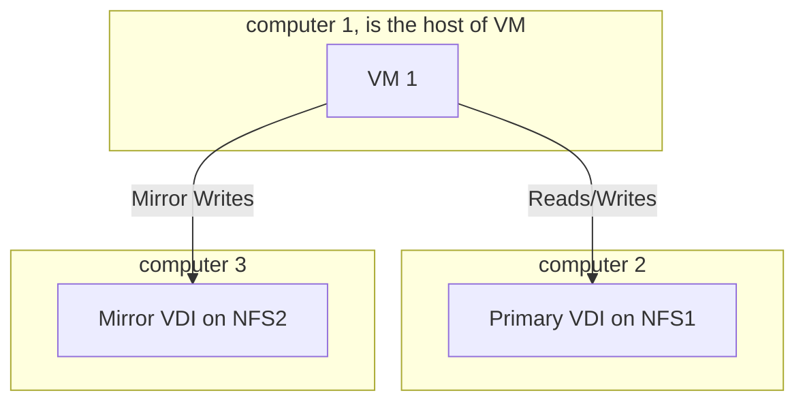

Creating a redundant Virtual Disk Image (VDI) setup for KVM over NFS (Network File System) can be done by leveraging mirroring techniques for redundancy. The goal is to ensure that the VDI image is mirrored on multiple storage backends to provide fault tolerance and data redundancy. Here’s how you can approach this setup:

### Steps to Set Up a Redundant VDI Image for KVM (Mirror) Over NFS

#### 1. **NFS Setup for Redundant Storage**
You need at least two NFS servers to store mirrored copies of the VDI image. These servers will serve as the backends for the mirrored VDI image.

##### Example NFS Export on Two Servers:
- **Server 1 (NFS1)** exports `/mnt/nfs1/vdis/`
- **Server 2 (NFS2)** exports `/mnt/nfs2/vdis/`

On each NFS server, you can export the directories by adding the following to `/etc/exports`:

```bash
# On NFS1
/mnt/nfs1/vdis *(rw,sync,no_subtree_check)

# On NFS2
/mnt/nfs2/vdis *(rw,sync,no_subtree_check)
```

Restart the NFS service on both servers to make the exports available.

```bash
sudo exportfs -a
sudo systemctl restart nfs-server
```

#### 2. **Mount NFS Shares on the KVM Host**
On the KVM host, mount the NFS exports from both NFS servers.

```bash
# Mount NFS1
sudo mount -t nfs NFS1:/mnt/nfs1/vdis /mnt/vdis_nfs1

# Mount NFS2
sudo mount -t nfs NFS2:/mnt/nfs2/vdis /mnt/vdis_nfs2
```

#### 3. **Create the VDI Image on Both NFS Mounts**
You will create identical VDI images on both NFS mounts to set up mirroring.

```bash
# Create a VDI image on NFS1
qemu-img create -f vdi /mnt/vdis_nfs1/vm1.vdi 20G

# Create a VDI image on NFS2 (mirror)
qemu-img create -f vdi /mnt/vdis_nfs2/vm1.vdi 20G
```

#### 4. **Set Up QEMU Mirroring**
QEMU allows real-time mirroring of virtual machine disks using the `drive-mirror` command, which will copy data from the primary VDI image to the mirrored VDI on another storage backend.

Here’s how you can configure QEMU to mirror the VDI to the secondary NFS location.

1. Start the VM using the primary VDI image (on NFS1):

```bash
qemu-system-x86_64 -drive file=/mnt/vdis_nfs1/vm1.vdi,format=vdi,if=virtio -m 2048
```

2. In a separate QEMU Monitor session (opened by pressing `Ctrl-Alt-2` in the QEMU window), execute the following to set up mirroring:

```bash
# Create a mirror to the VDI image on NFS2
drive_mirror device=virtio0 file=/mnt/vdis_nfs2/vm1.vdi format=vdi mode=top
```

This command mirrors writes to the primary VDI image on `/mnt/vdis_nfs1/vm1.vdi` to the secondary VDI image on `/mnt/vdis_nfs2/vm1.vdi`. The `mode=top` option ensures that the source disk is kept up-to-date during the mirroring process.

#### 5. **Monitor and Manage the Mirror**
You can monitor the mirroring process using the QEMU monitor. The mirroring can be paused, resumed, or canceled as needed. To query the status of the mirror:

```bash
info block
```

To cancel the mirroring (for example, after the sync is complete):

```bash
block_job_cancel drive-mirror
```

#### 6. **Automatic Failover with a Script**
You can create a script to automatically fail over to the mirrored VDI image on the secondary NFS server if the primary NFS server fails.

For example, check if the primary VDI is accessible, and if not, switch to the mirrored VDI:

```bash
#!/bin/bash
primary_vdi="/mnt/vdis_nfs1/vm1.vdi"
mirror_vdi="/mnt/vdis_nfs2/vm1.vdi"

if [ ! -f "$primary_vdi" ]; then
    echo "Primary VDI not available, switching to mirror."
    qemu-system-x86_64 -drive file=$mirror_vdi,format=vdi,if=virtio -m 2048
else
    echo "Primary VDI is available, starting VM."
    qemu-system-x86_64 -drive file=$primary_vdi,format=vdi,if=virtio -m 2048
fi
```

### 9. **Additional Considerations**
- **Live Migration**: With mirrored storage on NFS, live migration of VMs between hosts is easier, as both hosts can access the same VDI images.
- **Backup**: You can periodically take snapshots of the VDI images on both NFS servers to ensure data safety.
- Should test how to do this
  
### Visual Representation

Here is a Mermaid diagram to represent the mirrored setup:



In this diagram:
- `VM1` represents the virtual machine running on the KVM host.
- The VM writes to the primary VDI on `NFS1`, and the data is mirrored to the `VDI2` on `NFS2`.

### additional tests

- do a performance test
  - expose the VDI image over NBD and mount on the host directly and do test there (so not test from VM)

### remarks

- use btrfs as underlying FS