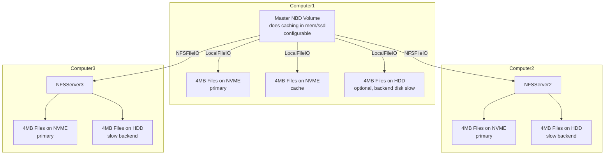

## Testing

we can do some first testing

```mermaid
flowchart TB
    %% Subgraph for Computer 1
    subgraph Computer1
        C1MasterNBD[Master NBD Volume<br>does caching in mem/ssd<br>configurable]
        SSD1[4MB Files on NVME<br>primary]
        SSD12[4MB Files on NVME<br>cache]
        HDD1[4MB Files on HDD<br>optional, backend disk slow]
    end

    %% Subgraph for Computer 2
    subgraph Computer2
        NFSServer2
        NFSServer2 --> SSD2[4MB Files on NVME<br>primary]
        NFSServer2 --> HDD2[4MB Files on HDD<br>slow backend]    
    end

    %% Subgraph for Computer 3
    subgraph Computer3
        NFSServer3
        NFSServer3 --> SSD3[4MB Files on NVME<br>primary]
        NFSServer3 --> HDD3[4MB Files on HDD<br>slow backend]
    end

    %% Connections between the master and slave NBDs
    C1MasterNBD -- LocalFileIO --> SSD1
    C1MasterNBD -- LocalFileIO --> SSD12
    C1MasterNBD -- LocalFileIO --> HDD1
    C1MasterNBD -- NFSFileIO --> NFSServer2
    C1MasterNBD -- NFSFileIO --> NFSServer3
```