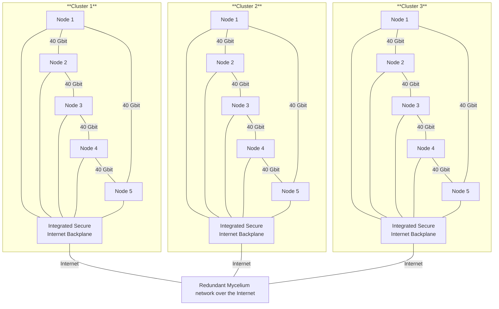

## MagicCloud Edge Cluster

Our MagicCloud series is our technology as is used in the larger <a href="https://threefold.info/datacenter/" target="_blank">Tier-S Datacenter</a> concept but applicable for remote offices or edge locations.

We call the product Magiccloud because if its truly unique magical features

- **Self-healing capabilities**
- **Scales globally**, adaptable to the needs of a global organization
- **Ultra-redundant** both at individual locations and across multiple locations
- **High performance** 
  - +1000 TPS for blockchain
  - +100,000 TPS for database
  - +800 GB/sec for storage
- **Super secure**
  - built for maximum safety on all levels
  - ask us for specially made configs e.g. in liquid cooling, EMP safe, ... 
- **Compatible with all required workloads**
  - ensuring flexibility
- **Deterministic deployment** 
  - using multi-signature deployment and smart contracts for IT
- **Quantum-safe storage**
  - Guaranteed data integrity, ensuring you never lose data
  - Full control over data location and management
- **Quantum-safe network**
  - A network that is impossible to intercept
  - Ideal for whitelisting and ultra-secure configurations
  - Capable of finding the shortest path between participants
  - Each participant (machine or human) has a unique, verifiable **IPv6 address**
  - There are clients for windows, osx, linux, mobile phones, ...
- **integrated monitoring & management**

---

Let me know if you'd like further tweaks!
## capacity of 1 cluster

The capacity per cluster is incredible:

- **+100,000 passmark per cluster**
- **480 GB of memory per cluster**
- **40,000 GB of high performance flash per cluster** = storage
- **40 gbit backplane, redundant**
- **2.5 gbit internet routing & firewall infrastructure**
- **+200 TOPS** (Tera Operations Per Second) for AI tasks

## Early Adopter Sale

- We are organizing a pre-sale, with an estimated delivery time of 4 to 6 months.
- Once we reach 100 clusters, the manufacturing process will commence in collaboration with a chosen ODM (Original Device Manufacturer).
- Pricing per cluster is 16,000 EUR, with an additional 500 EUR/month for maintenance, upgrades, and monitoring.
- Our Zero-OS & TFGrid version used is 4.0 (our latest generation which has quite some add ons to support this usecase)

> Question: how reliable is this solution? Please, checkout our public available cloud which is running as non commercial opensource project on https://www.threefold.io, this is now running for years and thousands of people use it.

## Comparison

**Classic VM Hypervisor**

- VM's only
- Complicated and not very Flexible
- All management done by people and quite manual or needs additional automation frameworks which add to complexity, cost and less security.
- So many features missing e.g. self healing, ... 
- Very expensive: 
  - VMWare new licensing for a cluster of this size would be: +3,000 USD per month for this config
    - (28*5)cores * 350 usd per year = 50,400 USD / year for their most advanced offering
  - Hardware: +50,000 USD but can be much more
  - If a need for 3e party Management, Monitoring, Automation would all be at additional cost

**Magic Cloud Edge Cluster is**

- faster
- more secure
- more flexible
- less expensive

## Config

- There are 5 compute nodes per Edge Cluster. 
- Each node is a powerful machine interconnected over 40 gbit with the other machines.
- There is an integrates switch/router which takes care of the communication to the internet.
- Redundant: If a node is down it can easly be replaced
- The total power consumption of a cluster (5 nodes) less than 600 watt.

## Use Cases

- high performance blockchain +1,000 TPS (supports hundreds of MagiCloud Edge Clusters)
- high performance database workloads, super redundant with master, and readonly followers over multiple locations which gives super fast read performance on each edge location.
- windows/linux VM's & Containers with integrated redundant block devices
- integrated **Quantum Safe Network and Quantum Safe Storage** (archive, fileservers, ...)
- edge applications
- remote offices (secure collaboration)
- integrates with our MagicCloud Smart Contract for IT system
- AI interference (not high performance though but enough for many workloads)
- Serverless functions, program different and scale unlimited while providing high security.

These configurations are ideal for edge locations, they are cost effective yet still super efficient and high performance.

### Blockchain

They will especially well act as blockchain nodes, the deployed private blockchain is multi technology:

- Dfinity, The Internet Computer, very capable blockchain technology. The smart contract language of Dfinity is called [Motoko](https://internetcomputer.org/docs/current/motoko/main/getting-started/motoko-introduction) and very capable and can do more than just blockchain.
- Private SUI blockchain, supports the [Move Language](https://move-language.github.io/move/) which is a good smart contract language.
- EVM compatible chains (less performing but quite stnd)

### Serverless Functions

We also optimized for serverless functions based on multiple languages

- Vlang
- WebAssembly
- ... 

### VM's & Container

- support Kubernetes, Docker or our own VM & Container technology
- full deterministic deployments are possible

## Architecture

## Planned hardware configuration

We are looking for an ODM to develop following config

- Each cluster is a highly efficient cluster in 1 chassis
- Each node is plugeable to be inserted in the cluster chassis
- The cluster has redundant power supply
- The cluster has integrated redundant switch/router for the connection to internet.
- The cluster has a 40 Gbit backplane for the internal communication, acts as a circle and as such is fully redundant. This 40 gbit backplane is used for the communication between the nodes in the cluster for storage and internal networking e.g. for the blockchain.

Harware Details:

- 96 GB memory per node (5 nodes)
- 2x4 TB high performance nVME flash per node = 5 x 2 x 4
- redundant backplane of 40 gbit between the nodes.
- 2.5 gbit connection to the Internet Backplane in the cluster
- 28 cores per node
- upto 5 5.2 GHz per core
- Intel Arc GPU with up to 12 Xe2 cores per node
- NPU (Neural Processing Unit): Integrated NPU capable of AI acceleration with 45 TOPS (Tera Operations Per Second) for AI tasks
- < 100 watt per node

