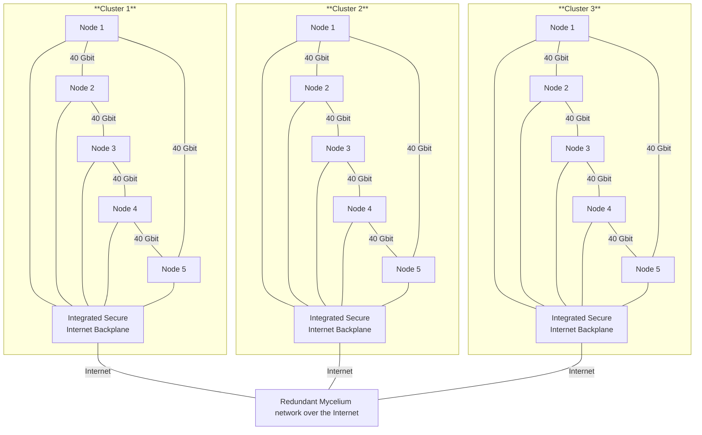

## MagicCloud Edge Cluster

- Each cluster is a highly efficient cluster in 1 chassis
- Each node is plugeable to be inserted in the cluster chassis
- The cluster has redundant power supply
- The cluster has integrated redundant switch/router for the connection to internet.
- The cluster has a 40 Gbit backplane for the internal communication, acts as a circle and as such is fully redundant. This 40 gbit backplane is used for the communication between the nodes in the cluster for storage and internal networking e.g. for the blockchain.

## capacity of 1 cluster

- **+100,000 passmark for the cluster**
- **480 GB of memory per cluster**
- **40,000 GB of high performance flash per cluster** = storage
- **40 gbit backplane, redundant**
- **2.5 gbit internet routing & firewall infrastructure**
- **+200 TOPS** (Tera Operations Per Second) for AI tasks

Details:

- 96 GB memory per node (5 nodes)
- 2x4 TB high performance nVME flash per node = 5 x 2 x 4
- redundant backplane of 40 gbit between the nodes.
- 2.5 gbit connection to the Internet Backplane in the cluster
- 28 cores per node
- upto 5 5.2 GHz per core
- Intel Arc GPU with up to 12 Xe2 cores per node
- NPU (Neural Processing Unit): Integrated NPU capable of AI acceleration with 45 TOPS (Tera Operations Per Second) for AI tasks
- < 100 watt per node

## Example usecases

- high performance blockchain +1,000 TPS (supports hundreds of MagiCloud Edge Clusters)
- high performance database workloads, super redundant with master, and readonly followers over multiple locations which gives super fast read performance on each edge location.
- windows/linux VM's & Containers with integrated redundant block devices
- integrated Quantum Safe Network and Quantum Safe Storage (archive, fileservers, ...)
- edge applications
- integrates with our MagicCloud Smart Contract for IT system
- AI interference (not high performance though but enough for many workloads)