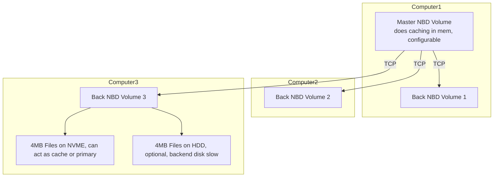

# Ideas for a production release of QBD

## first some questions

- can backend be in multiple files e.g. 4MB each, or configurable

## implementation

- we should support erasure coding or replication over multiple files
- we should support remote NBD devices as backend

