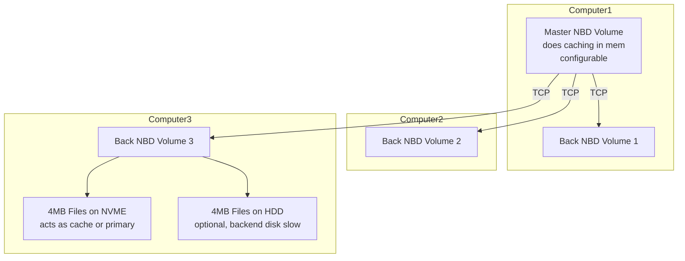
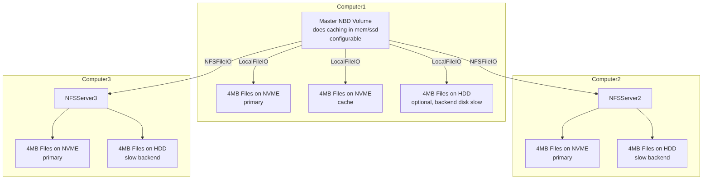

# Ideas for a production release of QBD

## first some questions

- can backend be in multiple files e.g. 4MB each, or configurable

## implementation

- we should support erasure coding or replication over multiple files
- we should support remote NBD devices as backend

> I realized later its probably better to first implement a version using networked filesystem as backend e.g. using NFS (see further)




- The communication between the master and back's can be replication or erasure coded.
- The 4MB files (configurable) have a naming convention so the back NBD volume knows which file to read/write to e.g. `file_0_0` for the first 4MB file on the first back NBD volume.
- The master NBD volume can be configured to cache in memory, or not, and can be configured to use a specific set of back NBD volume(s) for replication or erasure coding.
- For now TCP is ok between NBD master & backs, but would direct ethernet traffic be possible, not having to use TCPIP.
  
## requirements

- we should support erasure coding or replication over multiple files
- we should support remote NBD devices as backend
- we need to be able to verify the data integrity of the backend files
- prepare for dedupe (see below)
- configurable blocksize of the volume default 4KB but should be able to make e.g. 64KB
- configurable number of back NBD volumes
- a tool which can quickly verify if some files are missing and the redundancy level is not achieved
- ability to re-write the missing files to the back NBD volumes starting from the ones at front
  - its ok to expose the files over e.g. NFS so its easy for repair tool to get to all the files everywhere

## alternative maybe easier starting point

> recommend to do this first, easier to implement and troubleshoot, there is no difference between remote & local operation, because we just mount the right directories to remote locations (remote means always in same ethernet domain, machines not in WAN, same ethernet network L2)



- This might get some additional caching done on FS level. NFS is normally very fast.
- This might make a first version much more easy and maybe this is the best way how to do this anyhow, its simple and easy to track & troubleshoot
- the NBD master defines where to write, and makes decisions on where to read from in case some backends are gone

## use filesystem layout by a convention

```
/cache/1/
/data/.volumesmeta
/data/11/.meta
/data/11/a/1
/data/11/a/2
/data/11/a/123
/data/11/b/
/data/11/c/

```

- a, b, c defines the parts of the cluster e.g. in this case replication
- a/1 means first 4MB block of the volume
- a/123 means the 123e block of 4MB for the volume
- 1TB volume would have 256,000 blocks of 4MB,better to then take e.g. 32 MB files in stead of 4MB files
- the location of the e.g. 4KB block sits in the 4MB file based on position e.g. 10e 4KB block is on 10x (4KB+size meta) in the 4MB file, there is no positioning info or sparse, it means if we write 10e block and we didn't write 1-9e block, its all just 0000 on that location

#### .volumesmeta defines metadata about volumes

- sits on /data/.volumesmeta
- mapping between volume name and nr
- e.g. mydevice1 is nr 11

#### .meta defines some details about backend config

e.g. on /data/11/.meta

- erasure coded policy or replication
- blocksize
- if read only or not
- if append only or not
- ...


## dedupe

- dedupe can only be done towards a source volume which is read only (for now)
- dedupe process can only be done in the background, it goes over the 4KB blocks (or whatever blocksize is), it has a map of all hashes in mem of the source device, if matches then will write the metadata in the dedupe meta file, basically a pointer between the file we dedupe (the backend volume) and the source volume
- when dedupe then there is other file (dedupe meta file) per 4MB (or e.g. 32 MB) file which is the required metadata because then the data file now need to be sparse, to only have the relevant local data (it will be longer positional)
- in the dedupe meta file we have per 4KB block
  - 2bytes for the device nr (the source block device which is on /data/11)
  - 4bytes for the file number (the 4MB file e.g. /data/11/a/345)
  - 4bytes for the block number byte position (the 4KB position in the data file e.g. position byte 112,340 in /data/11/a/345)
  - the location of this 10 bytes is the block position e.g. block nr 1000 is 10000 bytes starting in the file
- this means we only need 10 bytes for 1x 4KB block to be represented,it can point to a local r/w data file (local to the disk) or remote in case of dedupe, this means that every read results in 1 lookup (IO operation) and 1 read in the required file, this is still fast and efficient and storage efficient
- it should be possible to use more than 1 source file to check for deduplication and can be done in multiple runs. The format of the dedupe metafile does not botter how many source files there are.

